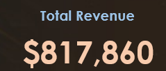
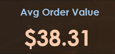
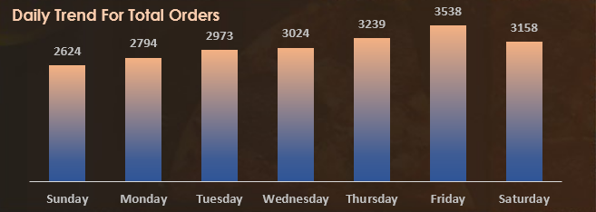
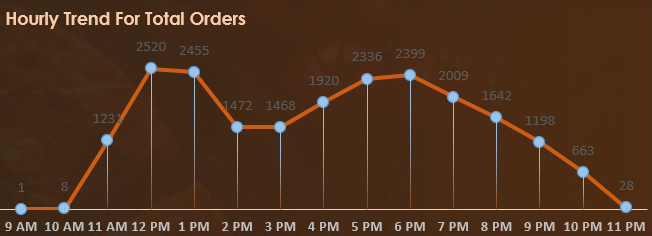
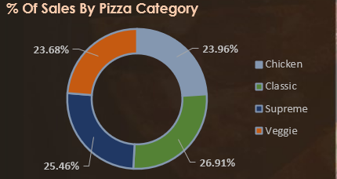
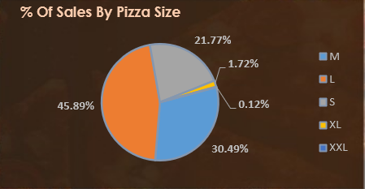
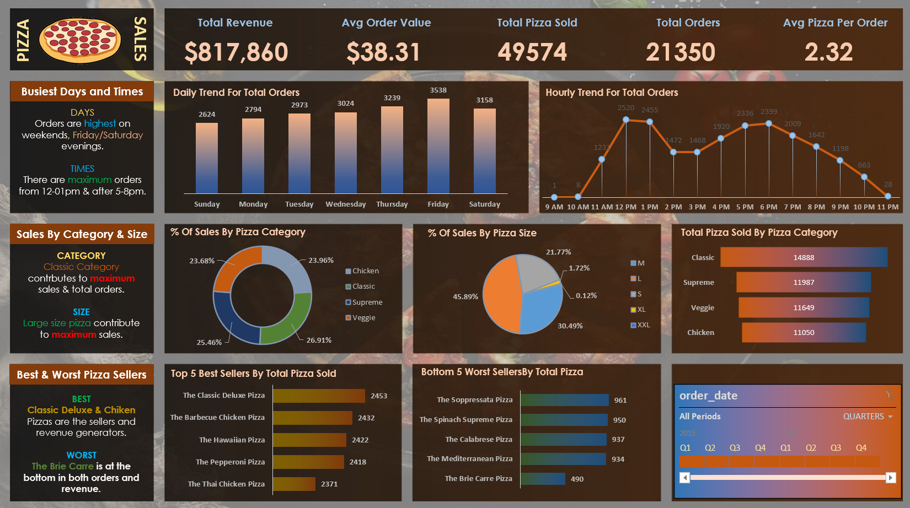

# Pizzs-store-analysis

I discovered this project online and conducted my own analysis based on it.

-[Project Link](https://www.youtube.com/watch?v=wGJYJ42V8OQ&t=4795s)

## Problem Statement:

1. KIP’s Requirement:
   We need to analyze key indicators for our pizza sales data to gain insight into our business performance. Specifically, we want to calculate the flowing metrics:
    1. Total Revenue: The sum of the total price of all pizza orders.
    2. Average Order Value: The average amount spent per order, calculated by dividing the total revenue by the total number of orders.
    3. Total Pizzas Sold: The sum of the quantities of all pizza sold.
    4. Total Orders: The total number of orders placed.
    5. Average Pizzas Per Order: The average number of pizzas sold per order, calculated by dividing the total number of pizzas sold by the total number of orders.

      
2. CHARTS Requirement:
   We would like to visualize various aspects of our pizza sales data to gain insight and understand key trends. We have identified the flowing requirements for creating charts:
   1. Daily Trend for Total Orders: Create a bar chart that displays the daily trend of total orders over a specific time period.
   2. Hourly Trend for Total Orders: Create a line chart illustrates the hourly trend of total orders throughout the day.
   3. Percentage Of Sales by Pizza Category: Create a pie chart that shows the distribution of sales across different pizza categories.
   4. Percentage Of Sales by Pizza Size: Generate a pie chart that represents the percentage of sales attributed to different pizza sizes.
   5. Total Pizzas Sold by Pizza Category: Create a funnel chart presents the total number of pizzas sold for each pizza category.
   6. Top 5 Best Sellers by Total Pizzas Sold: Create a bar chart highlighting the top 5 best-selling pizzas based on the total number of pizzas sold.
   7. Bottom 5 Worst Sellers by Total Pizzas Sold: Create a bar chart showing the bottom 5 worst-selling pizzas based on the total number of pizzas sold.

### Tools Used:

    1.	MS SQL Server DB: To import data and make quires to solve the problem.
    2.	Excel: Data manipulation and make analysis using pivot tables and data visualization to end with the final dashboard.

### Data Analysis and Insights:

- **Total Revenue:** 

- **Average Order Value:**  

- **Total Pizzas Sold:**  

- **Daily Trend for Total Orders:**  

- **Hourly Trend for Orders:**  

- **% of Sales by Pizza Category:**  

- **% of Sales by Pizza Size:**  

- **Total Pizzas Sold by Pizza Category:**  

- **Top 5 Best Sellers by Total Pizzas Sold:**  

- **Bottom 5 Best Sellers by Total Pizzas Sold:**  

- **Dashboard:**  
